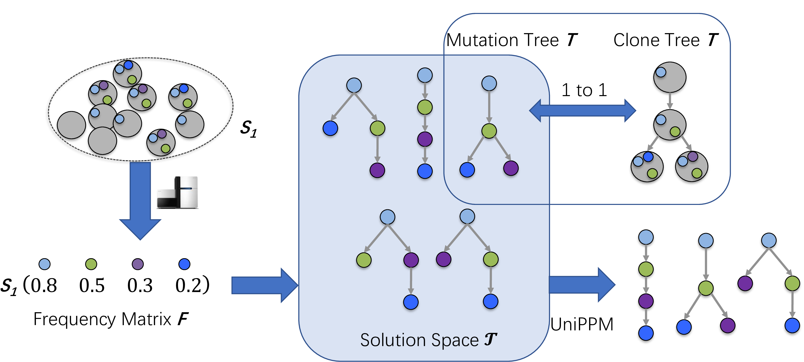

# UniPPM

UniPPM is an almost uniform sampler for the Perfect Phylogeny Mixture (PPM) problem, it takes a frequency matrix whoses rows are mixture of clones as input, and sample trees that satisfied the sum condition. UniPPM also support input in the form of reads and solve a maximum likelihood version of the problem (MLPPM). 

## Compliation and Usage instructions

UniPPM is written in Python 3 and requires UniGen:

1. http://www.cs.rice.edu/CS/Verification/Projects/UniGen/

Copy the python files to the path where you build UniGen2 and run the following command to sample solution trees.

    $python main.py [path/to/input_file.tsv] [output/directory/] [output_file_name] [#number_of_samples] [\lambda (if it is an MLPPM instance)] 

For instance to sample 100 trees from the solutions space of "n7_S81_k1_clustered.tsv" (a PPM instance) and store the results in test.trees you need to run:

    $python main.py input/simulate/n7_S81_k1_clustered.tsv output/ test 100

## Input format

The input file is a tab separated file (tsv) file encodes the frequencies of n mutations in m samples. The first line describes the format of the file. Each subsequent line encodes the frequency of a mutation in a sample.

    sample_index	sample_label	anatomical_site_index	anatomical_site_label	character_index	character_label	f-	f+
    0	P_0	0	P	0	0;1;2	1	1
    0	P_0	0	P	1	3;4	0.0434762	0.0434762
    0	P_0	0	P	2	6;9;10;13;16;19;20;22;24;25;26	0.72654	0.72654
    0	P_0	0	P	3	28;29;32	0.0350896	0.0350896
    0	P_0	0	P	4	30	0.274321	0.274321
    0	P_0	0	P	5	31;33	0.12951	0.12951
    0	P_0	0	P	6	35	0.178927	0.178927

For MLPPM, the input file is a tsv file encodes the numbers of variant reads and reference reads of n mutations in m samples.
Each subsequent line encodes the number of variant reads and the number of reference reads of a mutation in a sample.

    sample_index	sample_label	anatomical_site_index	anatomical_site_label	character_index	character_label	var	ref
    0	R1	0	B	0	cluster1	26	355
    0	R1	0	B	1	cluster2	4	392
    0	R1	0	B	2	cluster3	64	304
    0	R1	0	B	3	cluster4	35	390
    0	R1	0	B	4	cluster5	16	412
    0	R1	0	B	5	cluster6	0	342
    0	R1	0	B	6	cluster7	0	538
    1	R2	0	B	0	cluster1	0	244
    ...

## Output format

The output is a text file encodes the trees. The first line indicates the number of trees sample.

    #110 trees sampled

Each subsequent n lines describe a unique tree sampled. The first line indicates the number of edges of the tree, the index of the tree, and the number of how many copies of the tree are sampled. Each subsequent line describe an edge from a parent to a child, separated by a space.
    
    #6 edges, tree 0, 1 samples
    0;1;2 6;9;10;13;16;19;20;22;24;25;26
    6;9;10;13;16;19;20;22;24;25;26 30
    30 35
    31;33 28;29;32
    35 3;4
    35 31;33

